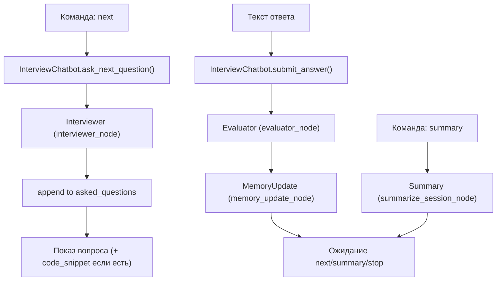

# Архитектура Interview Trainer (ЛР2)

## 1. Идея системы

`Interview Trainer` — мультиагентный тренажёр для подготовки к техническому собеседованию в чат‑режиме.
Пользователь задаёт профиль (позиция/стек/уровень/цели), после чего работает в цикле:
**вопрос → ответ → оценка → следующий вопрос**, а также может запросить **summary** по текущей сессии.

Цель лабораторной: собрать небольшой, но целостный пример МАС с **handoff**, **tools** и **памятью**.

## 2. Роли агентов (узлы)

- **`Router`**: выбирает маршрут (`interview`, `evaluate_only`, `plan_only`, `summary`) и подготавливает профиль кандидата (с учётом долговременной памяти).
- **`Interviewer`**: генерирует *один* вопрос за шаг; учитывает слабые темы; избегает повторов и чередует форматы (в т.ч. debugging/code‑review).
- **`Evaluator`**: оценивает ответ по рубрике (общий score и score по критериям), выделяет слабые темы, рекомендации и (опционально) уточняющий вопрос.
- **`Coach`**: строит план прокачки на 7–14 дней на основе оценки и слабых тем.
- **`Summary`**: строит итог **только по `qa_history` текущего запуска** (без подтягивания прошлых сессий).
- **`MemoryUpdate`** (технический узел): сохраняет итог сессии и статистику слабых тем в долговременную память.

Основная реализация узлов находится в `src/interview_trainer/nodes.py`.

## 3. Два режима исполнения

### 3.1. Интерактивный чат (основной сценарий)

В интерактивном режиме внешний цикл контролируется `InterviewChatbot` (`src/interview_trainer/chatbot.py`), который пошагово вызывает узлы:



### 3.2. Workflow‑граф (LangGraph)

Отдельно собран LangGraph‑workflow в `src/interview_trainer/graph.py` (`build_graph()`), который формализует маршрутизацию и retry‑цикл после оценки:

```mermaid
flowchart TD
  start([START]) --> routerNode["Router"]
  routerNode -->|"route = summary"| summaryNode["Summary"]
  routerNode -->|"route = plan_only"| coachNode["Coach"]
  routerNode -->|"route = evaluate_only"| evaluatorNode["Evaluator"]
  routerNode -->|"route = interview"| interviewerNode["Interviewer"]

  interviewerNode --> evaluatorNode
  evaluatorNode -->|"should_retry = true"| interviewerNode
  evaluatorNode -->|"should_retry = false"| coachNode
  coachNode --> memoryNode["MemoryUpdate"]
  summaryNode --> end([END])
  memoryNode --> end
```

## 4. Handoff и маршрутизация

- **После `Router`**:
  - `summary` → `Summary`
  - `plan_only` → `Coach`
  - `evaluate_only` → `Evaluator`
  - иначе → `Interviewer` → `Evaluator`

- **После `Evaluator`**:
  - при `should_retry = true` → возврат в `Interviewer` (ограничен `max_retries`)
  - иначе → `Coach`

Критерий retry в коде (`nodes.py`): `route == "interview"`, `score < 70` и `loop_count <= max_retries`.

## 5. Разнообразие вопросов и анти‑повторы

В `Interviewer` используется комбинация:

- **история выданных вопросов** в текущей сессии: `asked_questions` (обновляется в `InterviewChatbot.ask_next_question()` даже если пользователь не ответил);
- **ротация типов**: `question_type` выбирается по `loop_count` и не повторяет прошлый тип;
- **дедупликация по похожести**: нормализация + `SequenceMatcher` с порогом похожести (по умолчанию ~0.88);
- **ретраи генерации** с увеличением температуры (расписание \(0.4 \rightarrow 0.6 \rightarrow 0.8\)) и fallback‑вопросами для каждого типа;
- **`code_snippet`** для типа `debugging` (5–12 строк), чтобы добавлять формат “code‑review/поиск бага”.

## 6. Состояние (`InterviewTrainerState`)

Состояние определено в `src/interview_trainer/state.py` (TypedDict, total=False). Ключевые поля:

- **вход и маршрут**: `query`, `route`, `session_id`
- **профиль**: `position`, `stack`, `level`, `goals`
- **интервью‑шаг**:
  - `current_question`, `interview_question`
  - `current_question_type`, `current_code_snippet`
  - `current_expected_points`
  - `asked_questions` (история уже выданных вопросов)
- **ответ и оценка**:
  - `candidate_answer`
  - `rubric`, `evaluation`, `score`, `skill_scores`
  - `weak_topics`, `weak_topic_counts`, `recommendations`, `last_feedback`
- **сессионная память для summary**: `qa_history`, `summary_report`
- **план/вывод**: `coach_plan`, `final_response`
- **долговременная память**: `memory_snapshot`, `session_history`
- **управление циклом**: `should_retry`, `loop_count`, `max_retries`

## 7. Tools

В системе используются 3 инструмента (`src/interview_trainer/tools.py`):

1. `session_timer_logger_tool(action, session_id, payload)` — события таймера и журнал сессии (start/event/stop).
2. `rubric_generator_tool(position, stack, level)` — рубрика оценивания с критериями и весами под профиль.
3. `weak_topics_counter_tool(evaluation_result)` — преобразует слабые темы в счетчики `weak_topic_counts`.

## 8. Долговременная память

Память хранится в `data/memory.json` (путь можно переопределить через `INTERVIEW_MEMORY_PATH`).

Структура:
- `profile`: позиция, стек, уровень, цели
- `topic_stats`: накопленные счетчики слабых тем
- `sessions`: краткая история сессий (route, score, weak_topics и т.д.)

Как память влияет на систему:
- `Router` и `Interviewer` читают `memory_snapshot` для персонализации.
- `MemoryUpdate` обновляет `sessions` и `topic_stats`.
- Повторные запуски могут учитывать прошлые слабые темы.

## 9. Ограничения и идеи улучшений

- **Оценка LLM не всегда стабильна/корректна**, особенно если ответ короткий или требует уточнения условий.
- Улучшение: встроить **уточняющие вопросы** как обязательный шаг при низкой уверенности (схема “уточнение → дооценка”), а также делать привязку баллов к критериям рубрики (“критерий → наблюдение → балл”).
